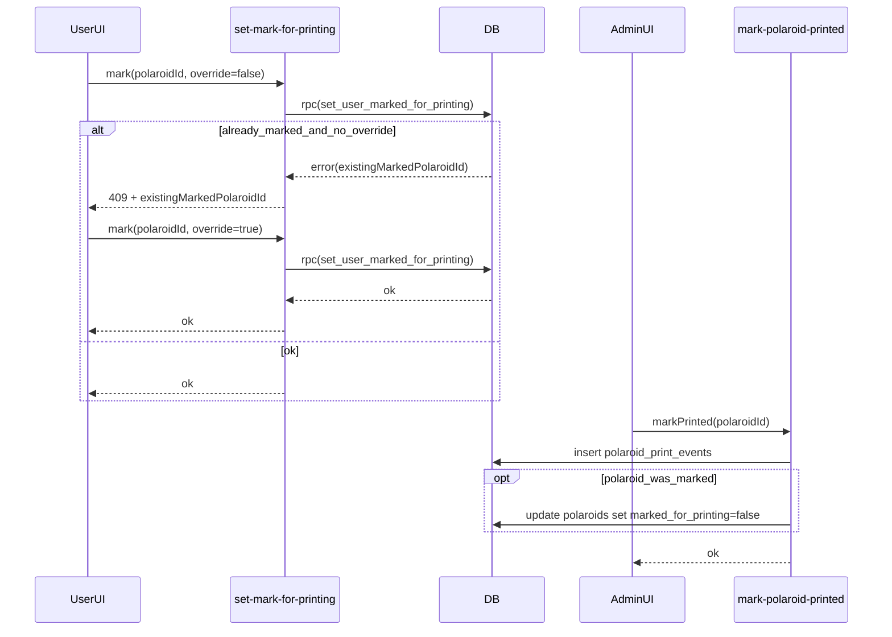

# Polaroid printing workflow plan

## Goals (behavior locked)

- Users can have **0 or 1** polaroids **marked for printing**.
- If a user already has one marked, marking another requires **confirmation to override**.
- Users can **unmark** their marked polaroid (back to 0 marked).
- Admin can:
  - See **all** polaroids
  - See which polaroids are **marked for printing** and **filter** by it
  - See **owner handle + owner user_id** for each polaroid
  - See **printed count** per user as **print events** count
  - Mark **any** polaroid as **printed** (creates a print event). If the printed polaroid itself was marked-for-printing, that mark is cleared. If a different polaroid is currently marked, it remains marked.

## Data model changes (Supabase migrations)

Update schema via a new migration in [`supabase/migrations/`](supabase/migrations/):

- **Add columns to `public.polaroids`**
  - `marked_for_printing boolean not null default false`
  - `marked_for_printing_at timestamptz null`

- **Enforce “0 or 1 marked per user” at the DB level**
  - Partial unique index: `unique(user_id) where marked_for_printing = true`

- **Add print events table** (for admin printed counts)
  - New table `public.polaroid_print_events`:
    - `id uuid primary key default gen_random_uuid()`
    - `polaroid_id uuid not null references public.polaroids(id) on delete cascade`
    - `user_id uuid not null references auth.users(id) on delete cascade` (owner)
    - `printed_by uuid not null references auth.users(id) on delete cascade` (admin)
    - `printed_at timestamptz not null default now()`
  - Indexes:
    - `(user_id, printed_at desc)`
    - `(polaroid_id, printed_at desc)`

- **Add RPC helpers for safe/efficient server logic**
  - `public.set_user_marked_for_printing(target_polaroid_id uuid, requesting_user_id uuid, override boolean)`
    - Validates ownership.
    - If another polaroid is already marked and `override=false`, raises an error that includes the currently-marked `polaroid_id`.
    - If allowed, atomically updates the user’s polaroids so exactly one is marked (or the target is marked).
  - `public.get_print_counts(user_ids uuid[]) returns table(user_id uuid, printed_count bigint)`
    - `select user_id, count(*) from polaroid_print_events where user_id = any(user_ids) group by user_id`

## New/updated Edge Functions (Supabase)

### User action: mark/unmark for printing

- **Add** [`supabase/functions/set-mark-for-printing/index.ts`](supabase/functions/set-mark-for-printing/index.ts)
  - Requires auth header.
  - Request body:
    - `polaroidId: string`
    - `marked: boolean`
    - `override?: boolean` (only meaningful when `marked=true`)
  - Behavior:
    - If `marked=false`: clears mark on that polaroid (only if owned).
    - If `marked=true`: calls `rpc(set_user_marked_for_printing)`.
      - If RPC indicates existing mark and `override=false`, return **409** with `{ existingMarkedPolaroidId }` so the UI can show confirmation.

### Admin action: mark a polaroid as printed

- **Add** [`supabase/functions/mark-polaroid-printed/index.ts`](supabase/functions/mark-polaroid-printed/index.ts)
  - Requires auth header + admin check (reuse same approach as [`supabase/functions/get-admin-polaroids/index.ts`](supabase/functions/get-admin-polaroids/index.ts)).
  - Request body: `polaroidId: string`
  - Behavior:
    - Look up polaroid owner (`user_id`) and whether `marked_for_printing` is true.
    - Insert into `polaroid_print_events`.
    - If the polaroid itself was marked, clear `marked_for_printing` + `marked_for_printing_at` on that polaroid.

### Admin list: include mark status + printed counts + filter

- **Update** [`supabase/functions/get-admin-polaroids/index.ts`](supabase/functions/get-admin-polaroids/index.ts):
  - Add request field: `markedForPrinting?: boolean`.
  - Apply filter when set: `.eq("marked_for_printing", true)`.
  - After retrieving the paginated polaroids:
    - Build unique `user_id` list for the page.
    - Call `rpc(get_print_counts)` once.
    - Attach `printed_count` onto each returned record for UI display.

## Frontend changes

### Shared types

- **Update** [`src/lib/polaroids.ts`](src/lib/polaroids.ts) `PolaroidRecord` to include:
  - `marked_for_printing?: boolean`
  - `marked_for_printing_at?: string | null`
  - `printed_count?: number` (admin-only enrichment)

### React Query hooks

- **Update** [`src/hooks/use-polaroids-query.ts`](src/hooks/use-polaroids-query.ts):
  - Add `useSetMarkForPrinting()` mutation calling `supabase.functions.invoke("set-mark-for-printing")`.
  - Add `useMarkPolaroidPrinted()` mutation calling `supabase.functions.invoke("mark-polaroid-printed")`.
  - On success, invalidate:
    - `['polaroids','user']`
    - `['admin-polaroids']`

- **Update** [`src/hooks/use-admin-polaroids-query.ts`](src/hooks/use-admin-polaroids-query.ts):
  - Extend `AdminPolaroidsFilters` with `markedForPrinting?: boolean`.

### UserPolaroids UX

- **Update** [`src/components/sections/user-polaroids.tsx`](src/components/sections/user-polaroids.tsx):
  - Add a “Mark for printing” control per tile.
  - When user attempts to mark a second polaroid:
    - Call mutation without `override`.
    - If it returns 409, show confirmation dialog (“Override existing marked card?”).
    - On confirm, call again with `override: true`.
  - If user clicks the already-marked polaroid’s control, it unmarks it.
  - Show a small visual indicator on the marked tile (badge/outline).

- **Update** [`src/components/polaroid/polaroid-tile.tsx`](src/components/polaroid/polaroid-tile.tsx):
  - Add optional props to render an additional action button in the user overlay (next to delete), or allow `children` overlay to include a button without fighting pointer-events.

- **Update translations** [`src/constants/translations.ts`](src/constants/translations.ts):
  - Add `userPolaroids.markForPrinting`, `userPolaroids.unmarkForPrinting`, `userPolaroids.overridePrintMarkConfirm` (and ES equivalents).

### Admin panel UX

- **Update** [`src/components/pages/admin-polaroids-page.tsx`](src/components/pages/admin-polaroids-page.tsx):
  - Add a filter control (checkbox or select) to filter `markedForPrinting`.
  - Add table columns:
    - **Owner**: `@handle` + shortened `user_id`.
    - **Marked**: badge if `marked_for_printing`.
    - **Printed count**: show `printed_count`.
  - Add row action: **Mark printed** (with confirmation), calling `useMarkPolaroidPrinted()`.

## Data flow (high level)

## Files expected to change

- Schema/migrations: [`supabase/migrations/`](supabase/migrations/)
- Edge functions:
  - [`supabase/functions/get-admin-polaroids/index.ts`](supabase/functions/get-admin-polaroids/index.ts)
  - [`supabase/functions/set-mark-for-printing/index.ts`](supabase/functions/set-mark-for-printing/index.ts) (new)
  - [`supabase/functions/mark-polaroid-printed/index.ts`](supabase/functions/mark-polaroid-printed/index.ts) (new)
- Frontend:
  - [`src/components/sections/user-polaroids.tsx`](src/components/sections/user-polaroids.tsx)
  - [`src/components/polaroid/polaroid-tile.tsx`](src/components/polaroid/polaroid-tile.tsx)
  - [`src/components/pages/admin-polaroids-page.tsx`](src/components/pages/admin-polaroids-page.tsx)
  - [`src/hooks/use-polaroids-query.ts`](src/hooks/use-polaroids-query.ts)
  - [`src/hooks/use-admin-polaroids-query.ts`](src/hooks/use-admin-polaroids-query.ts)
  - [`src/lib/polaroids.ts`](src/lib/polaroids.ts)
  - [`src/constants/translations.ts`](src/constants/translations.ts)

## Acceptance checklist

- User can mark exactly one polaroid; second mark prompts and only proceeds after confirmation.
- User can unmark.
- Admin table shows owner handle + user_id, marked indicator, and printed count.
- Admin can filter by marked.
- Admin can mark any polaroid as printed; it logs a print event and clears the mark only if that polaroid was marked.